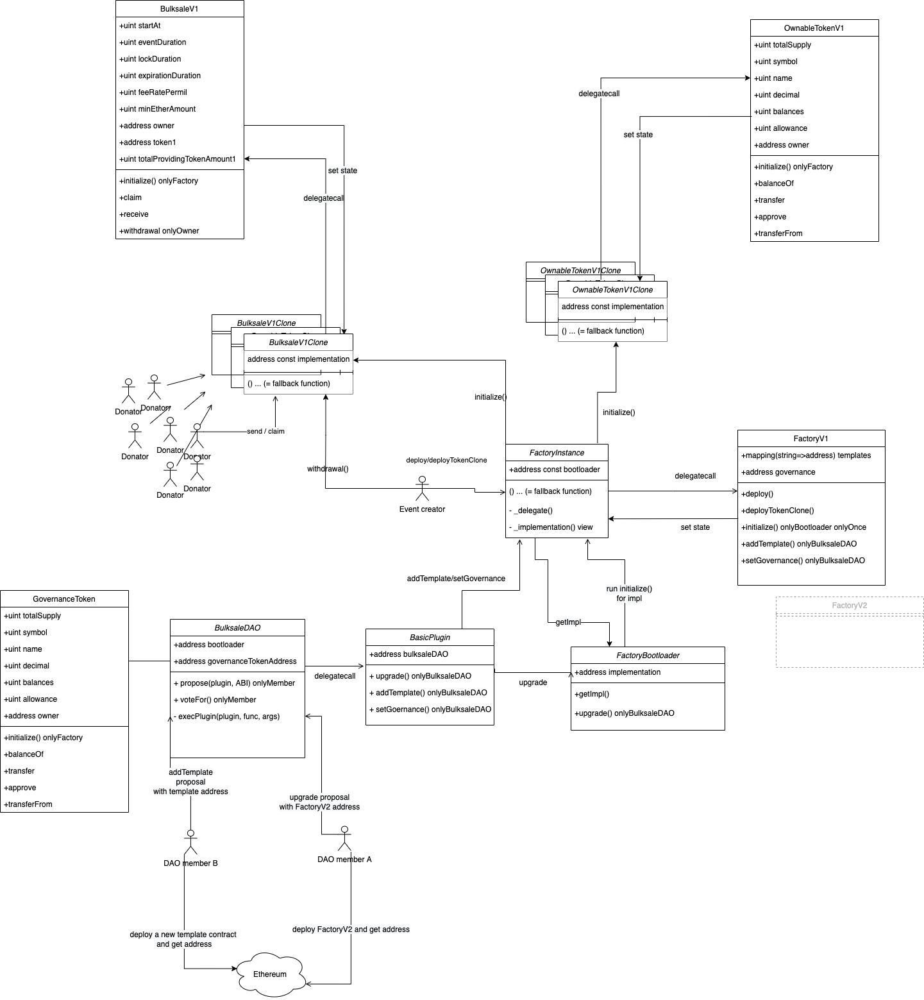

# Bulksale

## Overview (Use case diagram + Class diagram)




## Spec
- Foundation can add a new template contract.
- Deployer can generate a new clone contract from those template contracts.
- Template contracts can be either a bulksale contract or a token contract.
- [EIP-1167 Minimal Proxy Contract](https://eips.ethereum.org/EIPS/eip-1167) made deployer's clone generation so cheap, but foundation's template deployment is normal cost.
- It should hold an [initial bonding curve offering](https://github.com/hegic/initial-bonding-curve-offering/blob/master/contracts/InitialOffering/HegicInitialOffering.sol) session.
- It should lock a bulk of ERC-20 tokens beforehand.
- It should accept deposits of ETH during predefined term.
- It should deny accepting deposits if it's out of date.
- As per one's own share, that locked ERC-20 will be allocated accordingly.


## Rinkeby

`npm run deploy:testnet`

```
Factory is deployed as 0x2EE46278E7AFbA775000Fd818c02705e84c18795 by 0xdAe503Fd260358b8f344D136160c299530006170

Compiling 2 files with 0.8.3
Compilation finished successfully
SampleToken is deployed as 0x53e45c407728f7ae51008F42FEa77Daf1Ab62a54 by 0xD2dd063B77cdB7b2823297a305195128eF2C300c
BulksaleV1 is deploying with factory=0x2EE46278E7AFbA775000Fd818c02705e84c18795...
BulksaleV1 is deployed as 0x7F251A6c7d6343ec0a46C14690920AA6C7C0d8a6 by 0xdAe503Fd260358b8f344D136160c299530006170
Wainting for mining... (17000ms)
001th: BulksaleV1.0.sol
"mapping(BulksaleV1.0.sol => 0x7F251A6c7d6343ec0a46C14690920AA6C7C0d8a6)" is being registered to the Factory... (Factory.owner = 0xdAe503Fd260358b8f344D136160c299530006170)
deployUtil.recoverFactoryAddress() ... Embedded address is back to 0x5FbDB2315678afecb367f032d93F642f64180aa3 for BulksaleV1
[Finished] addTemplate :: BulksaleV1.0.sol=0x7F251A6c7d6343ec0a46C14690920AA6C7C0d8a6 is registered to factory=0x2EE46278E7AFbA775000Fd818c02705e84c18795


OwnableToken is deploying with factory=0x2EE46278E7AFbA775000Fd818c02705e84c18795...
OwnableToken is deployed as 0xA067740D80Ebc687d6b0F2f6A6F6c8d066b3AE51 by 0xdAe503Fd260358b8f344D136160c299530006170
Wainting for mining... (17000ms)
001th: OwnableToken.0.sol
"mapping(OwnableToken.0.sol => 0xA067740D80Ebc687d6b0F2f6A6F6c8d066b3AE51)" is being registered to the Factory... (Factory.owner = 0xdAe503Fd260358b8f344D136160c299530006170)
deployUtil.recoverFactoryAddress() ... Embedded address is back to 0x5FbDB2315678afecb367f032d93F642f64180aa3 for OwnableToken
[Finished] addTemplate :: OwnableToken.0.sol=0xA067740D80Ebc687d6b0F2f6A6F6c8d066b3AE51 is registered to factory=0x2EE46278E7AFbA775000Fd818c02705e84c18795


[Test] Deploying token clone... {"initialSupply":{"type":"BigNumber","hex":"0x314dc6448d9338c15b0a00000000"},"name":"VeryGoodToken","symbol":"VRG","owner":"0xdAe503Fd260358b8f344D136160c299530006170"}
Wainting for mining... (17000ms)
[Test] Token Clone Deployed: OwnableToken.0.sol=0x932D2c5B4Df7618d973d7f13Aa3d956115B2c370
[Test] Deploying sale clone... {"initialSupply":{"type":"BigNumber","hex":"0x314dc6448d9338c15b0a00000000"},"name":"VeryGoodToken","symbol":"VRG","owner":"0xdAe503Fd260358b8f344D136160c299530006170"}
Wainting for mining... (17000ms)
[Test] Sale Clone Deployed: BulksaleV1.0.sol=0x785e980BEC067096de1538d3875bcFe537dcc3f2

.embeddedMode is deleted. Now this command is initial mode. 0x5FbDB2315678afecb367f032d93F642f64180aa3 is on the contract-hard-coded-value.
```