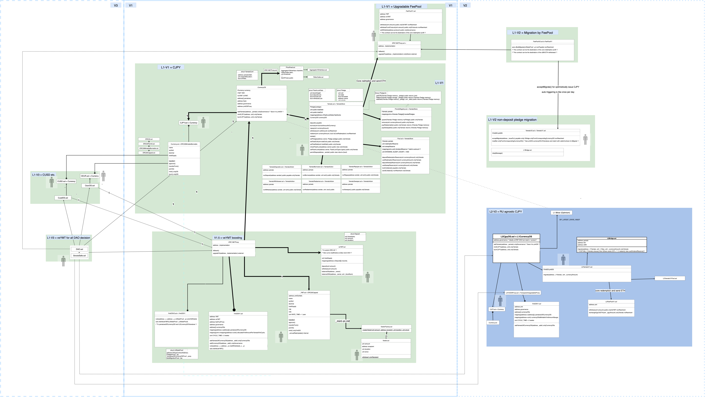

# Yamato Protocol

## Overview

A stablecoin lending machine.

- You can borrow CJPY with collateralising ETH.
- The CJPY token can be redeemed in ETH with 1 CJPY = 1 JPY rate (The ETH/JPY rate is calcurated by the ChainLink oracle. And the Tellor oracle is serving as a fail-safe oracle.)
- The total collateral ratio (TCR) won't be below 100% and so your CJPY always be kept safe.
- The reason why TCR is always above 100% is that the redemption criteria (= minimal collateral ratio / MCR) is 110% and so the protocol always has enough reserve.
- When a huge ETH price dump happens, the real value of the protocol reserve will be below 100%. And so we set a non-linear fee table to mitigate not to make the TCR near 110%.
- We use YMT token (designate like the great CRV token) allocation to make TCR higher, and gradually it will be decreased because a real lending infrastructure ideally don't need it.
- Any state transition could be back to the normal in the end.
- That's all, really.
- We'll provide various rationale of why it'll work well. Stay tuned ;)

-

## Spec

- See `./test/unit`

## Configurations

As of this writing, the following library versions have been confirmed working fine.

- Node: 14.16.1
- npm: 6.14.12
- hardhat: 2.1.1
- smock: 2.x

Please note, using a different version might result in commands like "npm i" and test to fail.

## dev: Getting Started

1. Install node & npm.
1. Clone the latest code from yamato repos.
1. Initialize the local work space.
   1. $ cd yamato
   1. $ mkdir typechain
   1. $ npm i
1. Running the compile & test.
   1. $ npx hardhat compile
   1. $ npx jest --projects unit.jest.config.ts

If it's working fine, you should be able to install the dependencies & see the tests run.
If not, please check that the npm dependencies are installed as expected referring to the Configurations section.

## goerli

### Running deployment

- `npm run deploy:goerli:reset`
- `npm run deploy:goerli` (with cached contracts / continue from resumed deployment)
  - If etherscan verification is failed, restart that by `npm run verify:goerli:all`
  - The deploy script is automatically handling the upgrade of latest implementation of UUPS
  - `npx hardhat deploy --tags <tag> --network <network>` gives your a chance to run a specific deploy script.
- `npm run test:integration`
  - Run this after deployment succeeded

### Running upgrade

- `npx hardhat run upgrade/batches/commit79597f-202203280247.ts --network goerli`
  - You can read what's going on in the script file.
  - We recommend to comment-in the only-using line of script, and check if the tx suceeded property one-by-one.

#### For only etherscan verification

`npm run verify:goerli:all`

### The latest goerli contract addresses

See `./deployments/goerli/*` files.

<!-- TBD -->
