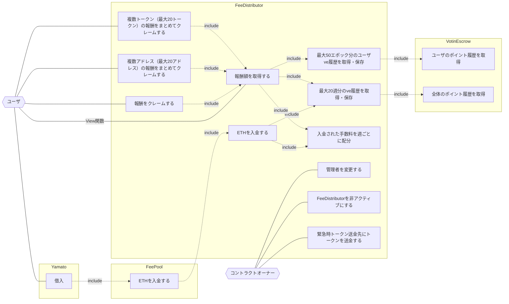

# 未完成

```mermaid
graph LR
    owner{{コントラクトオーナー}}
    user{{ユーザ}}
    deposit_reward_ether[ETHを入金する]
    send_fee_eth[ETHを入金する]
    claim[報酬をクレームする]
    claim_many[複数アドレス（最大20アドレス）の報酬をまとめてクレームする]
    claim_multiple_tokens[複数トークン（最大20トークン）の報酬をまとめてクレームする]
    claimable_token[報酬額を取得する]
    user_point_history[ユーザのポイント履歴を取得]
    point_history[全体のポイント履歴を取得]
    sync_ve[最大20週分のve履歴を取得・保存]
    sync_user_ve[最大50エポック分のユーザve履歴を取得・保存]
    checkpoint_token[入金された手数料を週ごとに配分]
    set_admin[管理者を変更する]
    kill[FeeDistributorを非アクティブにする]
    evacuate[緊急時トークン送金先にトークンを送金する]
    borrowing[借入]

    owner --- kill
    owner --- evacuate
    owner --- set_admin


    send_fee_eth -.->|include| deposit_reward_ether
    borrowing -.->|include| send_fee_eth

    deposit_reward_ether -.->|include| sync_ve
    deposit_reward_ether -.->|include| checkpoint_token

    user --- claim
    user --- claim_many
    user --- claim_multiple_tokens
    user ---|View関数| claimable_token
    user --- borrowing

    claim -.->|include| claimable_token
    claim_many -.->|include| claimable_token
    claim_multiple_tokens -.->|include| claimable_token
    claimable_token -.->|include| sync_ve
    claimable_token -.->|include| checkpoint_token
    claimable_token -.->|include| sync_user_ve

    sync_user_ve -.->|include| user_point_history
    sync_ve -.->|include| point_history


    subgraph FeePool
        direction LR
        send_fee_eth
    end

    subgraph FeeDistributor
        direction LR
        kill
        evacuate
        set_admin
        deposit_reward_ether
        claim
        claim_many
        claim_multiple_tokens
        claimable_token
        sync_ve
        sync_user_ve
        checkpoint_token
    end

    subgraph VotinEscrow
        direction LR
        user_point_history
        point_history
    end

    subgraph Yamato
      borrowing
    end
```
