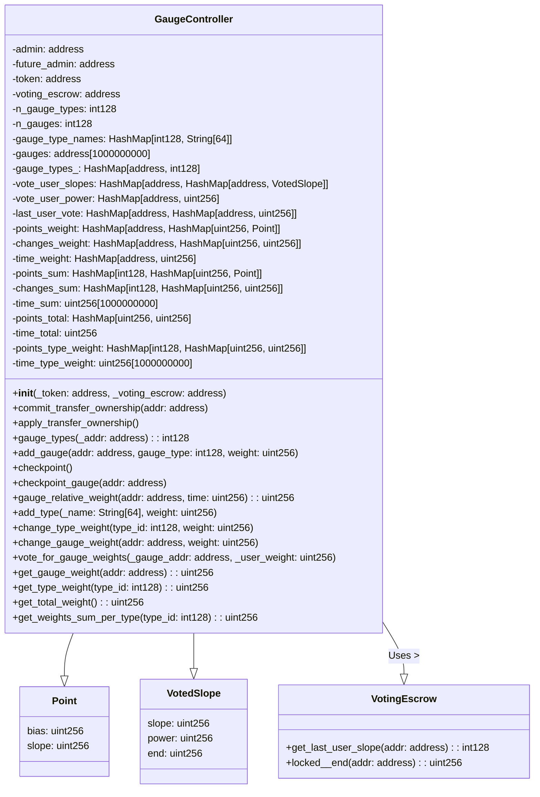

# GaugeController

```mermaid
classDiagram

    class GaugeController {
        -admin: address
        -future_admin: address
        -token: address
        -voting_escrow: address
        -n_gauge_types: int128
        -n_gauges: int128
        -gauge_type_names: HashMap[int128, String[64]]
        -gauges: address[1000000000]
        -gauge_types_: HashMap[address, int128]
        -vote_user_slopes: HashMap[address, HashMap[address, VotedSlope]]
        -vote_user_power: HashMap[address, uint256]
        -last_user_vote: HashMap[address, HashMap[address, uint256]]
        -points_weight: HashMap[address, HashMap[uint256, Point]]
        -changes_weight: HashMap[address, HashMap[uint256, uint256]]
        -time_weight: HashMap[address, uint256]
        -points_sum: HashMap[int128, HashMap[uint256, Point]]
        -changes_sum: HashMap[int128, HashMap[uint256, uint256]]
        -time_sum: uint256[1000000000]
        -points_total: HashMap[uint256, uint256]
        -time_total: uint256
        -points_type_weight: HashMap[int128, HashMap[uint256, uint256]]
        -time_type_weight: uint256[1000000000]
        +__init__(_token: address, _voting_escrow: address)
        +commit_transfer_ownership(addr: address)
        +apply_transfer_ownership()
        +gauge_types(_addr: address): int128
        +add_gauge(addr: address, gauge_type: int128, weight: uint256)
        +checkpoint()
        +checkpoint_gauge(addr: address)
        +gauge_relative_weight(addr: address, time: uint256): uint256
        +add_type(_name: String[64], weight: uint256)
        +change_type_weight(type_id: int128, weight: uint256)
        +change_gauge_weight(addr: address, weight: uint256)
        +vote_for_gauge_weights(_gauge_addr: address, _user_weight: uint256)
        +get_gauge_weight(addr: address): uint256
        +get_type_weight(type_id: int128): uint256
        +get_total_weight(): uint256
        +get_weights_sum_per_type(type_id: int128): uint256
    }

    class Point {
        bias: uint256
        slope: uint256
    }

    class VotedSlope {
        slope: uint256
        power: uint256
        end: uint256
    }

    class VotingEscrow {
        +get_last_user_slope(addr: address): int128
        +locked__end(addr: address): uint256
    }

    GaugeController --|> Point
    GaugeController --|> VotedSlope
    GaugeController --|> VotingEscrow: Uses >


```