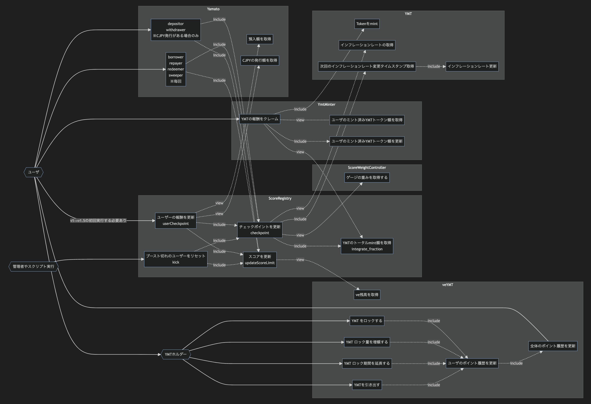
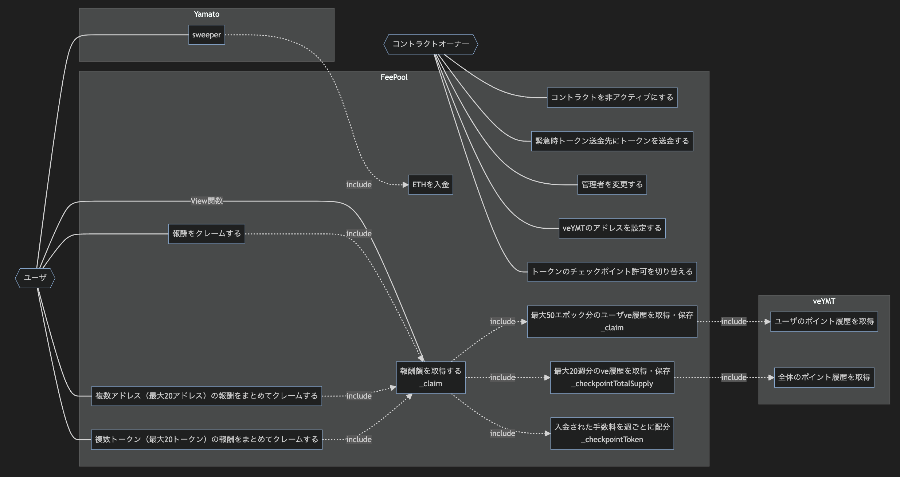

# Yamato Protocol ドキュメント v1.5

Yamato Protocol v1.5 に関するドキュメントを以下にまとめています。各コントラクトの詳細については、対応するリンクを参照してください。

## 新規追加のコントラクト一覧

- **[FeePoolV2](FeePoolV2/index.md)**  
  FeePoolV2 は、手数料プールの管理と手数料の分配を行うコントラクトです。

- **[ScoreRegistry](ScoreRegistry/index.md)**  
  ScoreRegistry は、ユーザーのスコアを計算し、YMT トークンの適切な配分情報を保存するコントラクトです。

- **[ScoreWeightController](ScoreWeightController/index.md)**  
  ScoreWeightController は、ScoreRegistry 毎の投票重み（分配率）を管理するためのコントラクトです。

- **[veYMT](veYMT/index.md)**  
  veYMT は、YMT トークンをロックして、ロック期間に応じた投票権を提供するコントラクトです。

- **[YMT](YMT/index.md)**  
  YMT は、Yamato Protocol に付随するユーティリティトークンのコントラクトです。

- **[YmtMinter](YmtMinter/index.md)**  
  YmtMinter は YMT トークンを mint するためのコントラクトです。

## veYMT ユースケース図

veYMT に関連するユースケースを以下の図で示しています。

## FeePool ユースケース図

手数料分配に関連するユースケースを以下の図で示しています。

