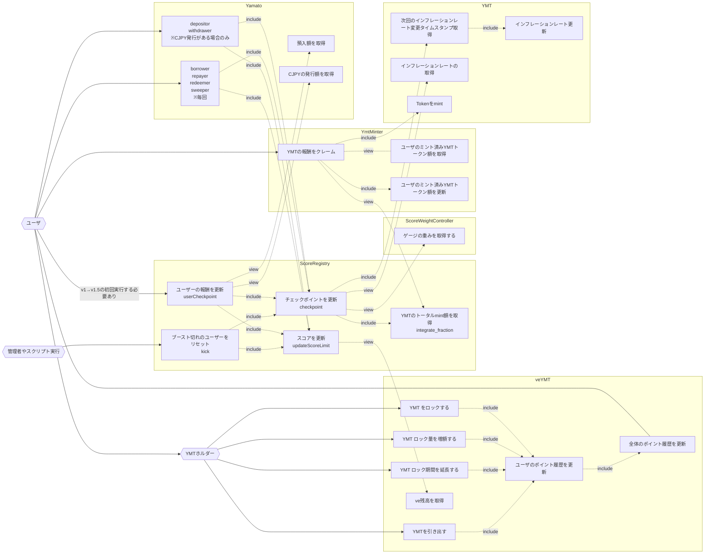

```mermaid
graph LR
    classDef transparent fill:none,stroke:none;

  %%======= action =======

    holder{{YMTホルダー}}
    user{{ユーザ}}
    keeper{{管理者やスクリプト実行}}

    %% Yamato
    user ---> yamato_action
    user ---> yamato_action_eth

    %% ScoreRegistry
    user ---> |v1→v1.5の初回実行する必要あり| userCheckpoint
    keeper ---> kick

    %% veYMT
    user --- ck
    user ---> holder
    holder ---> create_lock
    holder ---> increase_amount
    holder ---> increase_unlock_time
    holder ---> withdraw

    %% YmtMinter
    user ---> claim_YMT

  %%======= ScoreRegistry =======

    integrate_fraction[
        YMTのトータルmint額を取得
        integrate_fraction
        ]
    userCheckpoint[
        ユーザーの報酬を更新
        userCheckpoint
        ]
    checkpoint[
        チェックポイントを更新
        checkpoint
        ]
    updateScoreLimit[
        スコアを更新
        updateScoreLimit
        ]
    kick[
        ブースト切れのユーザーをリセット
        kick
    ]

    subgraph ScoreRegistry
      integrate_fraction
      userCheckpoint
      checkpoint
      updateScoreLimit
      kick
    end

    userCheckpoint -.->|include| checkpoint
    userCheckpoint -.->|include| updateScoreLimit
    kick -.->|include| checkpoint
    kick -.->|include| updateScoreLimit

    userCheckpoint -.->|view| collateral_ratio
    userCheckpoint -.->|view| balance_issued
    checkpoint -.->|view| gauge_relative_weight

    checkpoint -.->|include| integrate_fraction
    checkpoint -.->|include| future_epoch_time_write
    updateScoreLimit -.->|view| ve_total_supply
    checkpoint -.->|view| rate

  %%======= ScoreWeightController =======

    gauge_relative_weight[ゲージの重みを取得する]

    subgraph ScoreWeightController
      gauge_relative_weight
    end

  %%======= veYMT =======


    create_lock[YMT をロックする]
    increase_amount[YMT ロック量を増額する]
    increase_unlock_time[YMT ロック期間を延長する]
    withdraw[YMTを引き出す]
    uck[ユーザのポイント履歴を更新]
    ck[全体のポイント履歴を更新]
    ve_total_supply[ve残高を取得]

    subgraph veYMT
      ve_total_supply
      direction LR
      create_lock
      increase_amount
      increase_unlock_time
      withdraw
      uck
      ck
    end

    create_lock -.->|include| uck
    increase_amount -.->|include| uck
    increase_unlock_time -.->|include| uck
    withdraw -.->|include| uck
    uck -.->|include| ck

  %%======= YmtMinter =======

    claim_YMT[YMTの報酬をクレーム]

    subgraph YmtMinter
      direction LR
      claim_YMT
      minted
      update_minted
    end

    claim_YMT -.->|view| integrate_fraction

    claim_YMT -.->|include| mint
    claim_YMT -.-|view| minted
    claim_YMT -.->|include| update_minted

  %%======= Yamato =======

    collateral_ratio[預入額を取得]
    balance_issued[CJPYの発行額を取得]

    yamato_action_eth[
      depositor
      withdrawer
      ※CJPY発行がある場合のみ
    ]
    yamato_action[
      borrower
      repayer
      redeemer
      sweeper
      ※毎回
    ]

    subgraph Yamato
      collateral_ratio
      balance_issued
      yamato_action_eth
      yamato_action
    end

    yamato_action_eth -.->|include| checkpoint
    yamato_action -.->|include| checkpoint

    yamato_action_eth -.->|include| updateScoreLimit
    yamato_action -.->|include| updateScoreLimit

  %%======= YMT =======

    mint[Tokenをmint]
    rate[インフレーションレートの取得]
    future_epoch_time_write[次回のインフレーションレート変更タイムスタンプ取得]
    update_rate[インフレーションレート更新]
    update_minted[ユーザのミント済みYMTトークン額を更新]
    minted[ユーザのミント済みYMTトークン額を取得]

    subgraph YMT
      direction LR
      mint
      rate
      future_epoch_time_write
      update_rate
    end

    future_epoch_time_write -.->|include| update_rate

```
