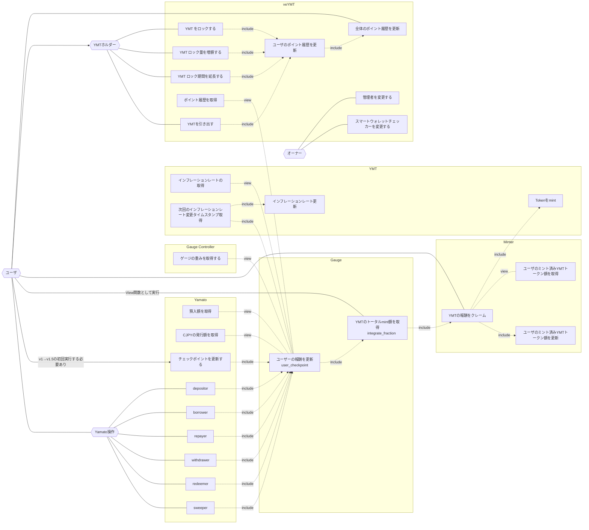

```mermaid
graph LR
    classDef transparent fill:none,stroke:none;
    owner{{オーナー}}
    holder{{YMTホルダー}}
    yamato{{Yamato操作}}
    user{{ユーザ}}

    create_lock[YMT をロックする]
    increase_amount[YMT ロック量を増額する]
    increase_unlock_time[YMT ロック期間を延長する]
    withdraw[YMTを引き出す]
    uck[ユーザのポイント履歴を更新]
    ck[全体のポイント履歴を更新]
    ve_total_supply[ポイント履歴を取得]

    mint[Tokenをmint]
    rate[インフレーションレートの取得]
    future_epoch_time_write[次回のインフレーションレート変更タイムスタンプ取得]
    update_rate[インフレーションレート更新]
    update_minted[ユーザのミント済みYMTトークン額を更新]
    minted[ユーザのミント済みYMTトークン額を取得]
    claim_YMT[YMTの報酬をクレーム]

    change_admin[管理者を変更する]
    change_smchecker[スマートウォレットチェッカーを変更する]


    claimable_tokens[
        YMTのトータルmint額を取得
        integrate_fraction
        ]
    user_checkpoint[
        ユーザーの報酬を更新
        user_checkpoint
        ]

    gauge_relative_weight[ゲージの重みを取得する]

    collateral_ratio[預入額を取得]
    balance_issued[CJPYの発行額を取得]
    first_checkpoint[チェックポイントを更新する]
    depositor
    borrower
    repayer
    withdrawer
    redeemer
    sweeper

    create_lock -.->|include| uck
    increase_amount -.->|include| uck
    increase_unlock_time -.->|include| uck
    withdraw -.->|include| uck
    uck -.->|include| ck
    user --- ck
    holder --- create_lock
    holder --- increase_amount
    holder --- increase_unlock_time
    holder --- withdraw

    user ---> holder
    user --- claim_YMT
    user ---|View関数として実行| claimable_tokens

    claimable_tokens -.->|include| claim_YMT
    claim_YMT -.->|include| mint
    claim_YMT -.-|view| minted
    claim_YMT -.->|include| update_minted

    future_epoch_time_write -.->|include| update_rate

    user ---> |v1→v1.5の初回実行する必要あり| first_checkpoint
    user_checkpoint -.->|include| claimable_tokens
    ve_total_supply -.-|view| user_checkpoint
    rate -.-|view| user_checkpoint
    future_epoch_time_write -.-|include| user_checkpoint

    owner --- change_admin
    owner --- change_smchecker

    user --- yamato
    yamato --- depositor
    yamato --- borrower
    yamato --- repayer
    yamato --- withdrawer
    yamato --- redeemer
    yamato --- sweeper

    depositor -.->|include| user_checkpoint
    borrower -.->|include| user_checkpoint
    repayer -.->|include| user_checkpoint
    withdrawer -.->|include| user_checkpoint
    redeemer -.->|include| user_checkpoint
    sweeper -.->|include| user_checkpoint
    first_checkpoint -.->|include| user_checkpoint
    collateral_ratio -.-|view| user_checkpoint
    balance_issued -.-|view| user_checkpoint
    gauge_relative_weight -.-|view| user_checkpoint

    subgraph Admin[ ]
      direction LR
    end

    class Admin transparent

    subgraph Gauge
      claimable_tokens
      user_checkpoint
    end

    subgraph Gauge Controller
      gauge_relative_weight
    end

    subgraph veYMT
      ve_total_supply
      direction LR
      create_lock
      increase_amount
      increase_unlock_time
      withdraw
      uck
      ck
      change_admin
      change_smchecker
    end

    subgraph YMT
      direction LR
      mint
      rate
      future_epoch_time_write
      update_rate
    end

    subgraph Minter
      direction LR
      claim_YMT
      minted
      update_minted
    end

    subgraph Yamato
      collateral_ratio
      balance_issued
      first_checkpoint
      depositor
      borrower
      repayer
      withdrawer
      redeemer
      sweeper
    end


```